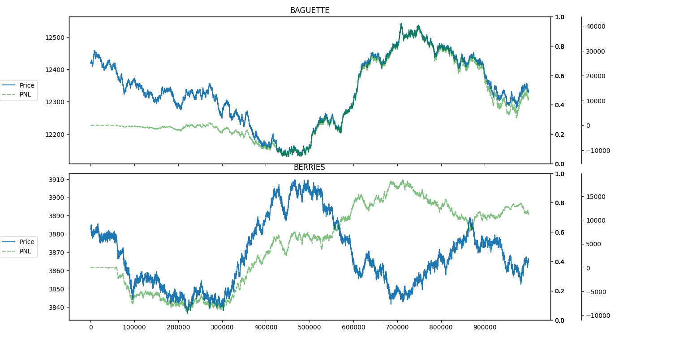
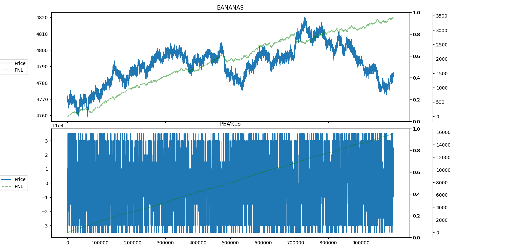
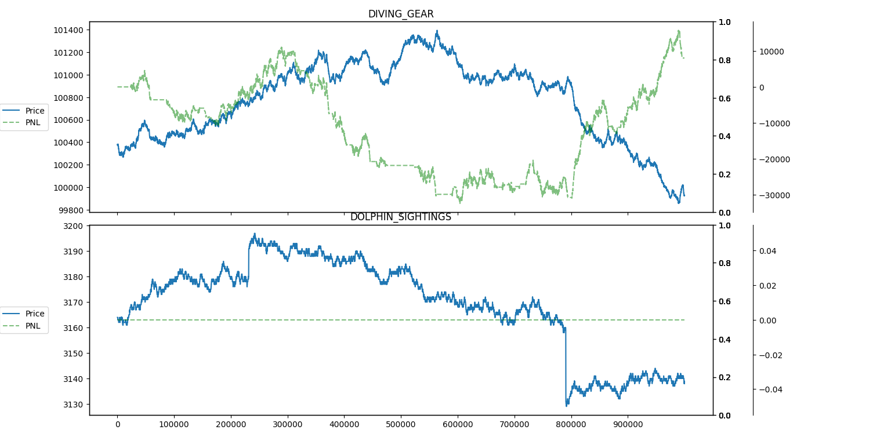
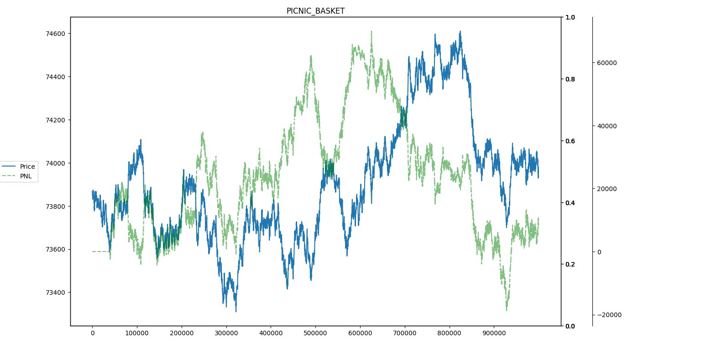
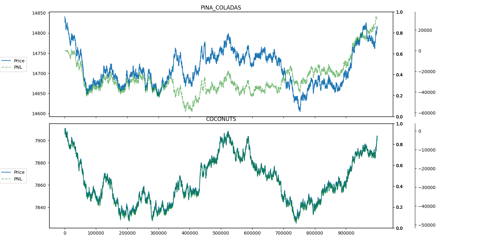

# ECBA QUANT TEAM IMC PROSPERITY SPRING 2023 RESULTS

This repository contains the relevant source code used by our team during the competition. Below are statistics regarding our performance. This was the first or second time competiting in a quantitative trading competition for the ECBA Quant Team. The competition took place from 20MAR2023 to 30MAR2023.

## Team Members 

Aryan Aggarwal, Saatvik Aggarwal, Ryan Flick, Varun Menta, Sanjay Sivakumar.

## Performance

- 1st: 1,101k
- 10th: 882k
- 100th: 523k 
- 141st: 423k <-- ECBA
- 200th: 302k

    ... out of 8,000 registered teams

## Final Round P&L Graphs

## Final Round P&Ls

- Baguette: 11167
- Picnic Basket: 7425
- Berries: 11625
- Ukulele: 0
- Diving Gear: 8025
- Bananas: 3432
- Pina Coladas: 30468
- Pearls: 15750
- Coconuts: 7903
- Dip: 0

**TOTAL: 85132**

## Technical Details

The trading file can be found in [main.py](/main.py). Archived round results can be found in [archive](/archive/). The [training](/training/) folder contains nearly all information provided during the competition for algorithmic trading. The [plot_results.py](/plot_results.py) file can be used for plotting results and running simulations through the [backtester](/backtester.py) which was based on [this repository](https://github.com/n-0/backtest-imc-prosperity-2023).

### Trading Strategies Used

- Mean reversion with simple and exponential moving averages
- Trend detection with triple exponential moving averages
- Bollinger bands
- Time based trading for berries
- Market making for pearls and berries

## Contact
Queries may be directed to: TexasECBA@gmail.com

